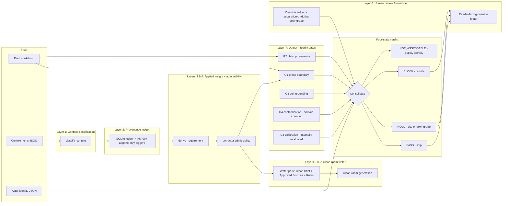

# WarrantOS Stack

WarrantOS is the product frame for a set of controls that make AI-assisted
work auditable before it becomes reader-facing output. The current
`claude-provenance` repository is the stdlib-first reference implementation
of the WarrantOS architecture; it is a working subset of the full
specification, not the full operating system.

## Architecture diagram

Reading the diagram: context flows top-to-bottom through classification,
admissibility, and the writer pack; the draft and the writer's output flow
through the five output integrity gates; the eight verdict signals consolidate
into one of four states; the override ledger sits beside the verdict layer so
human authority is recorded as structured evidence, not free text. Cross-cutting classification, retention, integrity, compliance and metrics
controls wrap the runtime path. Their internal implementation status does not
make the stack production qualified; adopter policy and independent operational
evidence remain required.

For the per-layer build state at the current version, see
[`STATUS.md`](STATUS.md). For the layer-to-module mapping table, see
[`OVERVIEW.md`](OVERVIEW.md).

## Working subset shipped today

The repository implements the warrant gates whose mechanics are stable:

- Provenance Ledger: record claim checks, outcomes, and epistemic debt.
- Context Admissibility: decide which pieces of process context may influence
  the answer, and how.
- BriefLock: hold a final artefact at the boundary until citation and context
  gates pass.
- Context Bill of Materials (CBOM): summarise which context entered the
  workflow, how it was classified, and which transformations were allowed.
- Prose Boundary Gate: block process narration from leaking into final prose.
- Multi-Agent Review: use separate agents or passes for generation,
  verification, adversarial review, and release judgement.

The stack is a governance pattern first and an implementation second. The
repo currently implements parts of the pattern for Claude Code and CLI
workflows. It should not be described as a general benchmark winner, a full
entailment engine, or a complete compliance product.

## Layer 1: Context Classification

`provenance.context_admissibility.classify_context()` tags every incoming
chunk into one of eleven canonical SPEC §2.2 classes: `empirical_evidence`,
`instruction`, `style_signal`, `user_feedback`, `prior_artefact`,
`process_history`, `operational_trace`, `review_finding`, `validation_rule`,
`synthesised_judgement`, `private_reasoning`. SPEC-L1-S005 review-role gating
threads the `source_agent` keyword through so a `policy-red-team` review
item stays a `review_finding` rather than collapsing into `user_feedback`.
The classifier is rule-based and intentionally inspectable; see
[`CONTEXT-ADMISSIBILITY.md`](CONTEXT-ADMISSIBILITY.md) for the per-class
admissibility table.

## Layer 2: Provenance Ledger

`provenance.ledger_write` and `provenance.overrides` persist every
classified context item and every human override into append-only SQLite
tables under `.warrant/provenance.db`. Storage-level append-only
enforcement is via SQLite `BEFORE UPDATE` triggers (INV-004); the row
schema is in `schema/provenance.sql`. The legacy v0.3 claim ledger at
`provenance.ledger` continues to support the `report`/`enforce` Stop-hook
loop and the evidence-matrix export.

## Layer 3: Applied Insight Compiler

`provenance.context_admissibility.derive_requirement()` transforms admitted
process material (user feedback, review findings, validation rules, style
signals) into structured derived requirements before the writer ever sees
it. Raw process text never reaches Layer 5; what reaches the writer pack
is the derived requirement. SPEC-L3-N001 closure: every transformation
writes a ledger row via `persist_context_transform()`.

## Layer 4: Context Admissibility Engine

Per-item admissibility flags decide which of six actor roles (classifier,
writer, reviewer, auditor, override-recorder, footer-renderer) can see
which `context_id`. The CBOM v0.2 carries the per-item flags so the
admissibility decision is auditable after the fact and not just a
configuration at runtime.

## Layer 5: Clean-Room Writer Pack

`provenance.writer_pack.compile_writer_pack()` composes the only context
the writer ever sees: a Clean Brief, the Approved Sources list, the Style
Rules, the Acceptance Tests, and the Banned Residue List. The five
sections map to SPEC §6.2. Private reasoning and process history are
excluded from the pack by construction, not by configuration.

## Layer 6: Clean-Room Generation

`provenance.clean_room.prepare_invocation()` enforces discipline mode: the
writer entry point refuses arbitrary context kwargs and runs the writer
model against the pack alone. SPEC-L6-S001 (discipline-mode) ships in
v0.6; SPEC-L6-R001 (subprocess isolation, Level 2 conformance) is wired
via `run_clean_room_subprocess()`. WarrantOS does not call any LLM
itself; the caller invokes their writer model through the
`InvocationPlan`.

## Layer 7: Output Integrity Gates

Five gates run over the writer's output:

- **G1 Prose Boundary** (BUILT): `scan_prose_boundary()` flags
  process-narration leakage ("based on your feedback", "this version is
  more commercial", etc.) under a named profile. v0.9 added a
  `prompt-template` profile after empirical calibration on real briefs.
- **G2 Source and Warrant Check** (BUILT): `provenance.verify` and
  `provenance.grade` provide three graders: a stdlib heuristic (default,
  no network), an Anthropic LLM grader (paid), and a local LLM grader
  (free, OpenAI-compatible). The heuristic cannot emit `contradicted` by
  construction; the LLM graders can.
- **G3 Non-Self-Grounding** (BUILT): `provenance.gates` flags the case
  where the writer model and the verifier model are the same family;
  wired into `warrantos check` via `--writer-model` / `--verifier-model`.
  Informational FLAG per SPEC-L7-N003, not BLOCK.
- **G4 Safety and Contamination** (BUILT, not production qualified): a policy-domain labelled corpus and patterns ship; adopters must extend them against their threat model.
- **G5 Evaluation and Calibration** (BUILT, not production qualified): internal corpus calibration ships; the offline heuristic emits no confidence and external evaluation remains required.

## Layer 8: Human Review and Decision Authority

`provenance.overrides.record_override()` rejects an override write if the
`risk_accepted` or `compensating_control` field is empty (SPEC-L8-S004).
`enforce_single_actor_rule()` flags a same-actor reviewer/writer pair when
an override is being recorded (SPEC-L8-S003). `render_override_footer()`
emits a reader-facing footer that surfaces every recorded override
(SPEC-L8-S005). Escalation routing is a documented taxonomy, not an
automated workflow.

## The four-state verdict

`cli/warrantos_cli.py::consolidate_verdict()` consolidates Layer 7 gate
outputs, the Layer 4 admissibility verdict, and the actor identity into
one of four states:

- `PASS` ship the artefact
- `HOLD` add a citation or downgrade a load-bearing claim
- `BLOCK` rewrite the offending text
- `NOT_ASSESSABLE` supply actor identity or use a non-final-prose profile

The thesis is that binary pass/fail loses information; `NOT_ASSESSABLE`
names the case where the artefact is missing the metadata required to
certify, instead of certifying on incomplete information.

## Foundation rows (cross-cutting)

The current implementation reports all 20 legacy rows as `BUILT`. That label
has a narrow ceiling: the code and internal enforcement probes exist. It does
not mean certification or production qualification.

- Policy and roles: implemented; principals remain declarative rather than
  host-authenticated.
- Data classification: a four-tier starter registry is implemented; adopters
  must extend the taxonomy.
- Audit and integrity: append-only SQLite controls and v2 bundle binding are
  implemented; operator-controlled keys still require external anchoring for
  non-repudiation against the operator.
- Retention: append-only tombstones are implemented; retention windows remain
  adopter policy.
- Compliance: self-assessment mappings exist; there is no accredited
  certification.
- Metrics and calibration: internal corpora and shadow metrics exist; these are
  not evidence of production performance.

The stack is not production qualified.

Claim support is also split from legacy `supported` wording. Citation detection
is `citation_present`; source resolution, passage location, support assertion,
`support_verified`, contest and contradiction are separate states carried by linked
source and claim-binding records.
## Product Positioning

Use this wording:

> WarrantOS is a warrant layer for AI-assisted work. The current
> `claude-provenance` implementation records claim provenance, checks source
> support, and adds early context-admissibility gates for final prose.

Avoid this wording:

> WarrantOS guarantees factual accuracy.

> WarrantOS is a complete compliance platform.

> WarrantOS has benchmark-proven superiority over other verification systems.

The honest claim is stronger: WarrantOS makes unsupported claims and process
leakage visible, reviewable, and gateable.
